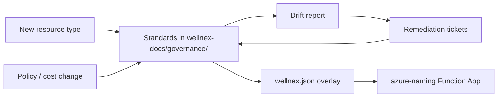

<!--
Repository: wellnex-projects
Path: projects/active/cloud-governance/README.md
Purpose: Long-running project that owns WellNex platform governance (naming, tagging, policy, drift, cost)
Author: GitHub Copilot (Claude Opus 4.7) with operator
Created: 2026-04-20
Last-Modified: 2026-04-20
Version: 0.1.0
-->

# Cloud Governance

> Long-running project. Owns the **enforceable** standards that bind
> every WellNex Azure resource: naming, tagging, policy, drift,
> cost. There is no end date — governance is a steady-state
> capability.

| Field | Value |
|-------|-------|
| Item ID | `wnif-01KPM83FVRPYJFDAC5VNDDCNYN` |
| Status | Active — Phase 0 (standards bootstrapped) |
| Stage | project (idea + issue + planning skipped; standards already exist) |
| Captured | 2026-04-20 (session `cloudgov`) |
| Owner | TBD |
| Standards home | [wellnex-docs/governance/](https://github.com/eny-tech/wellnex-docs/blob/main/governance/README.md) |
| Naming overlay | [wellnex-docs/governance/naming-overlays/wellnex.json](https://github.com/eny-tech/wellnex-docs/blob/main/governance/naming-overlays/wellnex.json) |
| Generator | [SanMar `azure-naming` Function App](https://github.com/sanmar/azure-naming) |

## Mission

Keep every WellNex cloud resource conformant to a small set of
written, machine-checkable standards — and keep those standards
**living documents** that evolve with the platform without
fragmenting into per-team variants.

## Why this is a project (not just docs)

Governance is not a one-shot deliverable. It is an ongoing loop:

Every loop has an owner, a cadence, and an artifact. Without a
project to hold them, the standards rot and the loop breaks.

## Scope

In:

- Cloud resource **naming** standard ([governance/cloud-resource-naming.md](https://github.com/eny-tech/wellnex-docs/blob/main/governance/cloud-resource-naming.md))
- Cloud resource **tagging** standard ([governance/cloud-resource-tagging.md](https://github.com/eny-tech/wellnex-docs/blob/main/governance/cloud-resource-tagging.md))
- The **`wellnex.json`** rule overlay consumed by `azure-naming`
- **Azure Policy** assignments that enforce the above (initial
  effect `Audit`, hardening to `Deny`)
- **Drift reporting** — what is in Azure that does not parse the
  standard, or is missing required tags
- **Exceptions register** — when a resource genuinely cannot conform
- **Cost rollups** by `wellnex.app` and `wellnex.env` tags
- Coordination with the [Remediation Agent project](../remediation-agent/README.md)
  to auto-flag drift findings

Out:

- IaC implementation details (lives in `wellnex-server/infra/`,
  `wellnex/infra/`, etc.)
- Application architecture (lives in `wellnex-docs/architecture/`)
- Per-feature SecOps work (handled by the SecurityReviewerAgent and
  per-feature plans)

## Anti-goals

- **No** parallel standards. One naming spec, one tagging spec, one
  overlay JSON. If a sub-team thinks it needs its own, that is a
  signal to amend the spec, not fork it.
- **No** governance-by-wiki-page. Every standard is normative
  Markdown in `wellnex-docs/governance/` plus, where applicable, a
  machine-readable artifact under `governance/<topic>/`.
- **No** silent deviations. Anything that does not conform is either
  drift (must be remediated) or an exception (must be in the
  register).
- **No** scope creep into application architecture, security
  threat-modelling, or planning. Those have their own homes.

## Phase 0 — bootstrapped (this session)

Done:

- [x] Naming standard v1.2.0 published
- [x] Tagging standard v1.1.0 published
- [x] Governance index README published
- [x] `wellnex.json` overlay published, JSON-validated, ready to
      drop into `azure-naming/rules/`
- [x] `wellnex-docs/README.md` index updated with Governance section
- [x] This project README created and linked

## Phase 1 — adoption (next)

- [ ] PR `wellnex.json` into the `azure-naming` repo `rules/`
      directory (priority `200`).
- [ ] Refactor `wellnex-server/infra/azure/main.tf` `locals` to
      derive names from the overlay template (or call the
      `azure-naming` API once available to WellNex).
- [ ] Apply the same refactor to any future WellNex IaC modules.
- [ ] Backfill required tags in existing dev / test resources.

## Phase 2 — enforcement

- [ ] Author Azure Policy definitions: required-tags-present,
      tag-allowed-values, name-matches-pattern.
- [ ] Assign at scope `Audit` first; review findings; harden to
      `Deny` for `prd` and `stg`.
- [ ] First drift report published.

## Phase 3 — steady state (ongoing)

- [ ] Monthly drift report. Findings → tickets → remediation.
- [ ] Quarterly review of `app` codes, `env` codes, `region` list,
      and the per-resource limit table for new Azure services.
- [ ] Cost rollup dashboard by tag, refreshed monthly.
- [ ] Exceptions register reviewed each quarter; expired exceptions
      either renewed or remediated.

## Cadences

| Cadence | Activity |
|---------|----------|
| Per PR to `wellnex-docs/governance/` | Project owner reviews and approves. |
| Monthly | Drift report. Standards-table review for new Azure services touched in that month. |
| Quarterly | Full standards review. Exceptions register triage. Cost rollup review. |
| Annually | Standards version bump (semver `MAJOR.MINOR.PATCH`); breaking changes require a migration window. |

## Decision log

Decisions about the standards are kept here and grow over time.

### 2026-04-20 — Naming v1.2.0 published

- Adopted CAF abbreviations as the authoritative `slug` source.
- Fixed `org=wnx`. Reserved against confusion with sibling tenants
  (e.g. SanMar `sm`).
- Eight `system` codes (`web`, `api`, `agents`, `obs`, `data`,
  `sec`, `core`, `iac`); free-form `subsystem` (`[a-z0-9]{2,8}`)
  for sub-components within a system.
- Five `env` codes (`prd`, `stg`, `tst`, `dev`, `sbx`).
- Segment order: `slug-org-region-env-system-[subsystem]-instance`.
  `slug` is first so portal alphabetical sort groups by resource
  type; remaining segments run **broad to narrow** within each
  type bucket.
- Two templates only: long (with `-`) and short (no `-`, with
  optional `random5` for global-uniqueness resources).
- Personal identifiers explicitly forbidden from names; owner goes
  to `wellnex.owner` tag.
- Earlier internal drafts (v1.0.0 with `org=wn` and `app` slug;
  v1.1.0 with `org`-first ordering) were never deployed; v1.2.0 is
  the first published ordering.

### 2026-04-20 — Tagging v1.1.0 published

- Eight required tags (`wellnex.system`, `wellnex.subsystem`,
  `wellnex.env`, `wellnex.owner`, `wellnex.cost_center`,
  `wellnex.repo`, `wellnex.managed_by`,
  `wellnex.data_classification`) and four optional. Required-tag
  enforcement starts at `Audit` and hardens to `Deny` after Phase
  2 drift hits zero.

## Related

- Standards: [wellnex-docs/governance/](https://github.com/eny-tech/wellnex-docs/blob/main/governance/README.md)
- Generator service: [SanMar `azure-naming`](https://github.com/sanmar/azure-naming)
- Sister project (auto-flagging drift): [remediation-agent](../remediation-agent/README.md)
- WellNex IaC consumer (today): [wellnex-server/infra/azure/](https://github.com/eny-tech/wellnex-server/tree/main/infra/azure)
